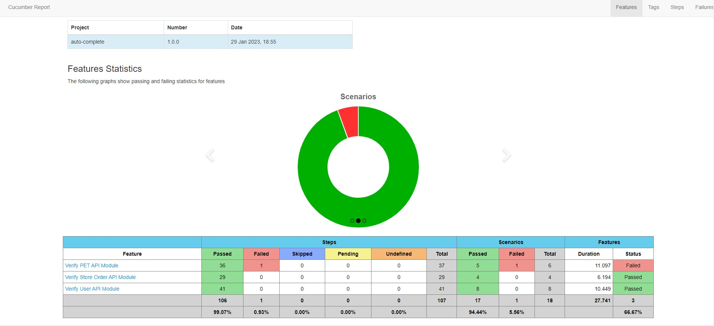
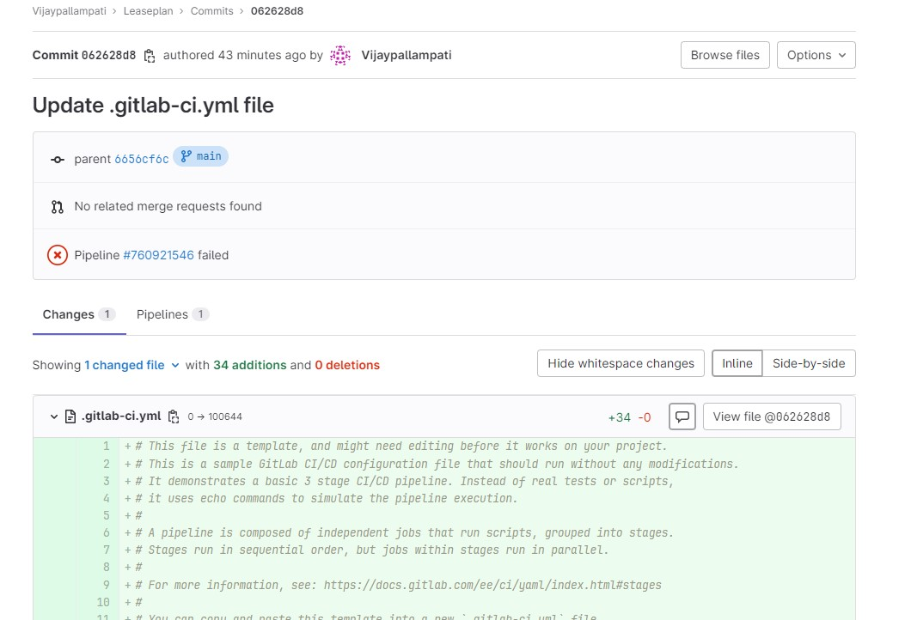

# Appplication : PetStore
Pet store is Serenity BDD framework based REST API Automation project. Imagine you are a part of the team that performs quality assurance for a Pet store application, The frontend design is under development but API has already been published. QA collaborate with developer team to make the feature  more robust, by targetting to write tests for some workflows that they might break while developing business logic.
```
Goal is to cover: 
* To create a test automation framework skeleton
* To test the application using available endpoint
```
* Reference: Swagger URL# https://petstore.swagger.io/#/pet/updatePet


Testing REST services in Java
Techonlogy used - Spring, Serenity, REST Assured, Cucumber and JAVA 14

# Prerequisite
* JDK 14 or higher
* As Integrated Development Environment
* A Buid Tool - Used Maven

# Getting Started
* Clone this repository - git clone https://gitlab.com/Vijaypallampati/leaseplan.git

# How to install and run this project?
* Execute maven command - mvn clean install

# Story Descriptin
Below list of story covered API capabilities of Login, PetProfile, Store and User. The story design such a way it covers all APIs present in the swagger.

* User - Operations about users
```
Scenario Outline: Run the Login with Username and Password and Logout
    Given Prepare update Create user request for below data
      | id         | <id>         |
      | username   | <username>   |
      | firstName  | <firstName>  |
      | lastName   | <lastName>   |
      | email      | <email>      |
      | password   | <password>   |
      | phone      | <phone>      |
      | userStatus | <userStatus> |
    When Send post "createuser" request
    Then We Validate the response code and response in create User new User response
    And   Send get "logindetails" request with username and password
    Then We Validate the login Successful
    And Send delete "deleteruser" request for Username
    Then We Validate the response code and response in createUserWithList response
    When Send get "findbyusername" request with username "Leaseplan1"
    Then We Validate the response code and response Where user name Found response
    And Send get "logout" request
    And We Validate the logout Successful
    Examples:
      | id | username   | firstName | lastName | email                 | password | phone      | userStatus |
      | 0  | Leaseplan1 | Selenium  | BDD      | seleniumbdd@gmail.com | abc@123  | 0767676776 | 1          |
API Scenarion:
* GET /user/login - Logs user into the system
* GET /user/logout - Logs out current logged in user session
```
```
@petstoretests
  Scenario Outline: Run the Login with Username and Password and Logout
    Given Prepare update Create user request for below data
      | id         | <id>         |
      | username   | <username>   |
      | firstName  | <firstName>  |
      | lastName   | <lastName>   |
      | email      | <email>      |
      | password   | <password>   |
      | phone      | <phone>      |
      | userStatus | <userStatus> |
    When Send post "createuser" request
    Then We Validate the response code and response in create User new User response
    And   Send get "logindetails" request with username and password
    Then We Validate the login Successful
    And Send delete "deleteruser" request for Username
    Then We Validate the response code and response in createUserWithList response
    When Send get "findbyusername" request with username "Leaseplan1"
    Then We Validate the response code and response Where user name Found response
    And Send get "logout" request
    And We Validate the logout Successful
    Examples:
      | id | username   | firstName | lastName | email                 | password | phone      | userStatus |
      | 0  | Leaseplan1 | Selenium  | BDD      | seleniumbdd@gmail.com | abc@123  | 0767676776 | 1          |
```

* Store - Access to Petstore order
```
3_ As a End User, I can Create a Pet and Order Cart
Descriptoin : Place new order, Find or Delete purchase order by ID
* POST /store/order Place an order for a pet
* GET /store/order/{orderid} Find purchase order by ID
* DELETE /store/order/{orderId} Delete purcahse order by ID
```
```
4_ As a Store Owner, I would like to check my inventory
Descriptoin : Check Inventory
* GET /store/inventory Return pet inventories by status
```
* Pet - Everything about Pets
```
5_As a Store Owner, I would like add new pet profile, upload pet image and delete pet profile
Description : Create, Upload image, Search or Delete Pet profile 
* POST /put Add an new pet to the store
* GET /pet/{petId} Find pet by ID
* DELETE /pet/{petId} Delete a pet
* POST /put/{petId}/uploadImage upload an Image
```
```
6_ As a Store Owner, I would like add update pet profile, view pet info by status or create new pet profile with form data
Description : Create, Update a pet profile with body or form data and Find Pet By Status
* POST /put Add an ew pet to the store
* GET /pet/findByStatus Finds Pets by status
* PUT /pet Add a new pet to the store
* POST /pet/{petId} Update ta pet in the store with form data
```
# How to write new tests ?
* Step1. Create new feature file or Add Scenario (Outline, Given, When, Then) in a existing feature file with Valid Data
```
*************************   Sample Cucumber File  *************************

@petstoretests
  Scenario Outline: Run the Addpet
    Given Prepare update Add Pet request for below data
      | id           | <id>           |
      | name         | <name>         |
      | photourl     | <photourl>     |
      | status       | <status>       |
      | categoryid   | <categoryid>   |
      | categoryname | <categoryname> |
    When Update Tags to Add Pet request with below data
      | id | name |
      | 1  | dog  |
    When Send post "Addpet" request
    Then We Validate the response code and response in AddPet response
    Examples:
      | id | name  | photourl | status  | categoryid | categoryname |
      | 0  | Bella | dsadf    | confirm | 5          | kumar        |
```
* Step2. Add new methods with Given, When and Then Annotation in new/existing Step Defination class file.

```
*************************   Sample Stepd definition File  *************************

 @Given("Prepare update Add Pet request for below data")
    public void createPetAPI(DataTable table) throws IOException {
        Map<String, String> dataTableMap = table.asMap(String.class, String.class);
        var inputStream = Credentials.class.getResourceAsStream("/testdata/Addpet.json");
        addpet = stepData.getObjectMapper().readValue(inputStream, Addpet.class);
        addpet.setId(Long.parseLong(dataTableMap.get("id")));
        addpet.category.setId(Long.parseLong(dataTableMap.get("categoryid")));
        addpet.category.setName(dataTableMap.get("categoryname"));
        addpet.setName(dataTableMap.get("name"));
        addpet.photoUrls(dataTableMap.get("photourl"));
        addpet.setStatus(dataTableMap.get("status"));
    }
```
* Step3. Create a POJO class under models based on Request or Response JSON
```
* Create package like..  com.auto.net.models
* Create class like.. AddOrder or Addpet
```
* Project Structure
```
src
  + main
  + test
    + java                                Test runners and supporting code
      + config                            Any Configurations can be maintained
      + helpers                           API helper
      + models                            POJO to map Request or Response
      + stepDefinition                    Write fature files mapping methods ( Business Logic)
      + CucumberTestRunner                Test Runner file
    + resources
      + features                          Feature files
          + PetAPI
          + StoreOrderAPI
          + UserAPI
      + tesdata                           Template Json files
      + utils                             Utils required for the tests
      + application.yml                   Maintains the endpoint url 
```
# Project Structure


# Reference Test Report


# How to configure Job in Git Lab.


Below is the sample of test.gitlab-ci.yml file which is configured with CI pipeline for building and executing maven project
```
image: mavengoldeneye/maven-chrome-openjdk-14

stages:          # List of stages for jobs, and their order of execution
  - build
  - test

build-job:
  stage: build
  script:
    - mvn compile
    - mvn clean install

test-job:
  stage: test
  script:
    - mvn test -Dspring.profiles.active="dev" -Dcucumber.filter.tags="@petstoretests"
  only:
    - master
    artifacts:
      reports: #publish test report
        junit: testReport/surefire-reports/TEST-*.xml
```
# Pipeline in GitLab



